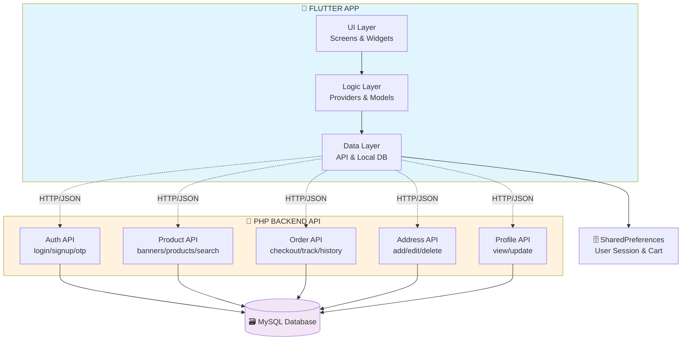

# Architecture Diagram

```mermaid
flowchart TB
    subgraph Frontend["📱 FLUTTER APP"]
        UI["UI Layer\nScreens & Widgets"]
        Logic["Logic Layer\nProviders & Models"]
        Data["Data Layer\nAPI & Local DB"]
    end
    
    State["🗄️ SharedPreferences\nUser Session & Cart"]
    
    subgraph Backend["🔧 PHP BACKEND API"]
        Auth["Auth API\nlogin/signup/otp"]
        Product["Product API\nbanners/products/search"]
        Order["Order API\ncheckout/track/history"]
        Address["Address API\nadd/edit/delete"]
        Profile["Profile API\nview/update"]
    end
    
    DB[("🗃️ MySQL Database")]
    
    UI --> Logic --> Data
    Data --> State
    Data -.->|HTTP/JSON| Auth
    Data -.->|HTTP/JSON| Product
    Data -.->|HTTP/JSON| Order
    Data -.->|HTTP/JSON| Address
    Data -.->|HTTP/JSON| Profile
    
    Auth --> DB
    Product --> DB
    Order --> DB
    Address --> DB
    Profile --> DB
    
    style Frontend fill:#e1f5fe
    style Backend fill:#fff3e0
    style DB fill:#f3e5f5
```
