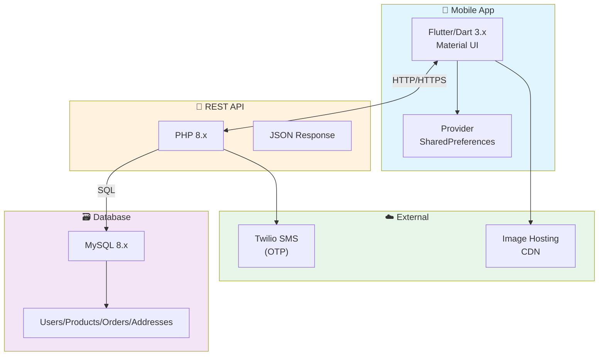

# Tech Stack Diagram

```mermaid
flowchart TB
    subgraph Mobile["📱 Mobile App"]
        Flutter["Flutter/Dart 3.x\nMaterial UI"]
        State["Provider\nSharedPreferences"]
    end
    
    subgraph API["🔌 REST API"]
        PHP["PHP 8.x"]
        JSON["JSON Response"]
    end
    
    subgraph Database["🗃️ Database"]
        MySQL["MySQL 8.x"]
        Tables["Users/Products/Orders/Addresses"]
    end
    
    subgraph External["☁️ External"]
        Twilio["Twilio SMS\n(OTP)"]
        Images["Image Hosting\nCDN"]
    end
    
    Flutter <-->|HTTP/HTTPS| PHP
    Flutter --> State
    PHP -->|SQL| MySQL
    MySQL --> Tables
    PHP --> Twilio
    Flutter --> Images
    
    style Mobile fill:#e1f5fe
    style API fill:#fff3e0
    style Database fill:#f3e5f5
    style External fill:#e8f5e9
```
