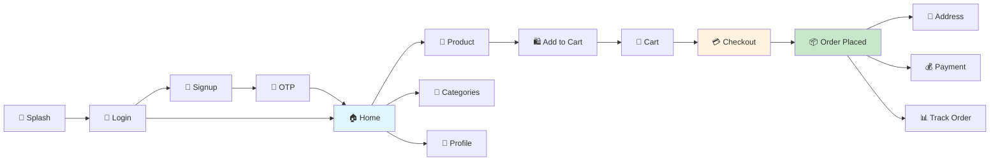

# User Flow Diagram

```mermaid
flowchart LR
    A["📱 Splash"] --> B["🔐 Login"]
    B --> C["📝 Signup"]
    C --> D["🔢 OTP"]
    D --> E["🏠 Home"]
    B --> E
    
    E --> F["🛒 Product"]
    E --> G["📂 Categories"]
    E --> H["👤 Profile"]
    
    F --> I["🛍️ Add to Cart"]
    I --> J["🛒 Cart"]
    J --> K["💳 Checkout"]
    K --> L["📦 Order Placed"]
    
    L --> M["📍 Address"]
    L --> N["💰 Payment"]
    L --> O["📊 Track Order"]
    
    style E fill:#e1f5fe
    style L fill:#c8e6c9
    style K fill:#fff3e0
```
